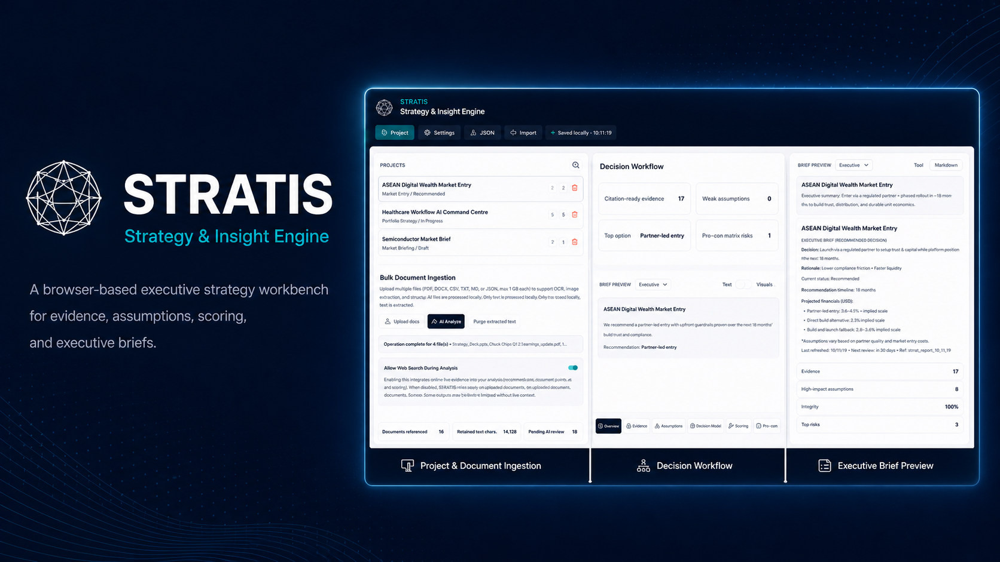
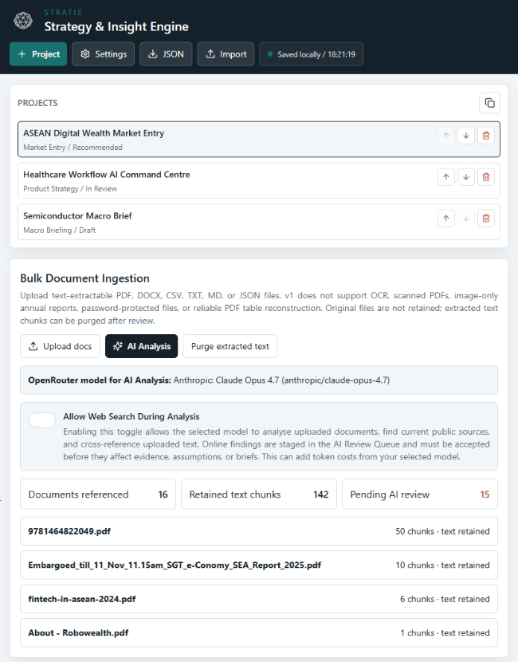
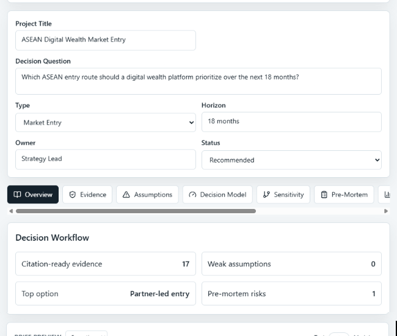
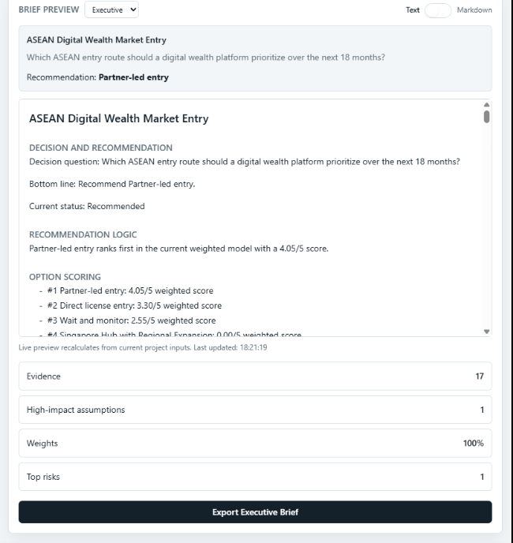

# Stratis: Strategy & Insight Engine

A browser-based executive strategy workbench for converting evidence, assumptions, strategic options, financial inputs, and risks into decision-ready briefs with auditable scoring logic.

Stratis is designed for strategy, product, platform, and market analysis workflows where the recommendation matters but the reasoning trail matters just as much.

<p align="center">
  
</p>

---

## Product thesis

Strategic recommendations often get built across scattered notes, spreadsheets, PDFs, decks, and ad hoc AI prompts. The result is a familiar problem: the final answer may sound polished, but the evidence, assumptions, scoring logic, and sensitivity analysis are difficult to audit.

Stratis treats strategy work as a structured decision workflow:

> Evidence → Assumptions → Options → Scores → Sensitivity → Pre-mortem → Brief → Decision Log

The goal is not to be another generic AI summariser. The goal is to make strategic reasoning reviewable, source-aware, and decision-useful.

---

## What this demonstrates

Stratis is a portfolio-grade product build that demonstrates:

- Productised decision support rather than generic summarisation.
- Evidence management and source-quality discipline.
- Assumption tracking and uncertainty calibration.
- Weighted option scoring with visible rationale.
- Sensitivity analysis and pre-mortem thinking.
- Browser-side document ingestion and staged AI review.
- Executive brief generation with an auditable reasoning trail.
- Static-site deployment suitable for GitHub Pages.

---

## Core use cases

| Use case | Example question |
|---|---|
| Market entry | Which ASEAN country and entry route should a digital wealth platform prioritise? |
| Product strategy | Which product feature should be prioritised given impact, risk, and feasibility? |
| Platform strategy | Which architecture option best balances reuse, control, cost, and compliance? |
| Financial analysis | Which scenario changes the recommendation under different margin or growth assumptions? |
| Macro briefing | Which market signals materially affect executive attention this week? |

---

## Key features

### 1. Project workspace

Create and manage structured strategy projects with a decision question, horizon, owner, type, and status.

### 2. Bulk document ingestion

Upload text-extractable PDF, DOCX, CSV, TXT, MD, or JSON files. Extracted chunks can be retained for review and used as evidence inputs.

Current limitations:

- No OCR for scanned PDFs.
- No reliable reconstruction of complex PDF tables.
- No password-protected document support.
- Original files are not retained; extracted text chunks are staged for review.

### 3. Evidence workspace

Capture citation-ready evidence with source type, claim, implication, confidence, relevance, and notes.

### 4. Assumption ledger

Track high-impact assumptions, confidence levels, validation tests, invalidation triggers, and linked evidence.

### 5. Decision model

Compare strategic options using weighted criteria, option scores, and score rationales. Weighted totals are recalculated automatically.

### 6. Sensitivity analysis

Test how changes in weights or assumptions could alter the top-ranked recommendation.

### 7. Pre-mortem builder

Identify plausible failure causes, mitigations, early warning indicators, and risk owners.

### 8. AI review queue

Use optional AI extraction to analyse uploaded documents. Findings are staged for review before they can affect evidence, assumptions, or briefs.

### 9. Executive brief generator

Generate executive-ready or detailed rationale views from the current project state, including recommendation logic, option scoring, assumptions, risks, and evidence references.

### 10. Local persistence and export

Save work locally in the browser, export/import project JSON, and export executive briefs in Markdown.

---

## Application screenshots

<table>
  <tr>
    <td width="33%" align="center" valign="top">
      
    </td>
    <td width="33%" align="center" valign="top">
      
    </td>
    <td width="33%" align="center" valign="top">
      
    </td>
  </tr>
  <tr>
    <td width="33%" valign="top">
      <sub>
        <strong>Project & Document Ingestion</strong><br>
        Organises strategy projects, ingests supporting documents, retains extracted text chunks, and stages AI-generated findings for review before they enter the evidence base.
      </sub>
    </td>
    <td width="33%" valign="top">
      <sub>
        <strong>Decision Workflow</strong><br>
        Connects the decision question, project context, evidence readiness, assumptions, top option, and risk indicators into a reviewable strategy workflow.
      </sub>
    </td>
    <td width="33%" valign="top">
      <sub>
        <strong>Executive Brief Preview</strong><br>
        Converts the current project state into an executive-ready recommendation, including recommendation logic, option scoring, assumptions, evidence counts, risks, and exportable brief structure.
      </sub>
    </td>
  </tr>
</table>

<p>
  <strong>Decision-support workflow in practice.</strong><br>
  These views demonstrate how Stratis turns fragmented strategy inputs into a structured, reviewable decision workflow. Source documents are ingested and staged, evidence is separated from assumptions, options are scored through visible criteria, and the final recommendation is assembled into an executive brief with its reasoning trail intact.
</p>

<p>
  The product is intentionally designed around auditability: users can inspect what evidence was used, what assumptions mattered, how options were weighted, and which risks or sensitivity factors could change the recommendation.
</p>

---

## Product documentation

| Document | Purpose |
|---|---|
| [`docs/prd.md`](docs/prd.md) | Product requirements document |
| [`docs/product-brief.md`](docs/product-brief.md) | Product thesis and positioning |
| [`docs/architecture.md`](docs/architecture.md) | Static app architecture and module boundaries |
| [`docs/evidence-standard.md`](docs/evidence-standard.md) | Evidence quality and citation standard |
| [`docs/scoring-methodology.md`](docs/scoring-methodology.md) | Option scoring and sensitivity methodology |
| [`docs/ai-workflow-design.md`](docs/ai-workflow-design.md) | AI review, provenance, and OpenRouter workflow |
| [`docs/roadmap.md`](docs/roadmap.md) | Staged release plan |

---

## Sample projects

The repository includes synthetic sample projects for demonstration and testing:

1. **ASEAN Digital Wealth Market Entry**  
   Market-entry strategy, country ranking, entry-route scoring, and executive recommendation.

2. **Healthcare Workflow AI Command Centre**  
   Regulated workflow operations, evidence review, AI-assisted triage, and decision support.

3. **Semiconductor Macro Brief**  
   Macro briefing workflow with market signals, evidence, assumptions, and executive synthesis.

All sample content is synthetic or public-reference-style demonstration data. Do not use confidential or proprietary documents in the public deployment.

---

## Tech stack

| Layer | Technology |
|---|---|
| Frontend | React, Vite, TypeScript |
| Styling | Tailwind CSS |
| Charts | Recharts |
| Document ingestion | pdfjs-dist, Mammoth, Papa Parse |
| Local persistence | LocalStorage / browser-side storage |
| AI workflow | OpenRouter-compatible, session-only user API key |
| Testing | Vitest |
| Deployment | GitHub Pages / GitHub Actions |

---

## Architecture

Stratis is designed as a static, browser-first application.

```text
User uploads documents
        ↓
Browser-side text extraction
        ↓
Retained text chunks
        ↓
AI review queue or manual evidence entry
        ↓
Evidence and assumption workspace
        ↓
Option scoring and sensitivity analysis
        ↓
Pre-mortem and decision log
        ↓
Executive brief export
```
